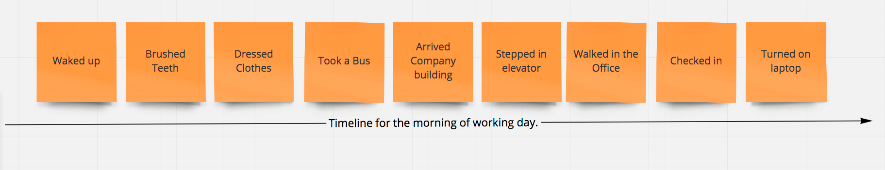
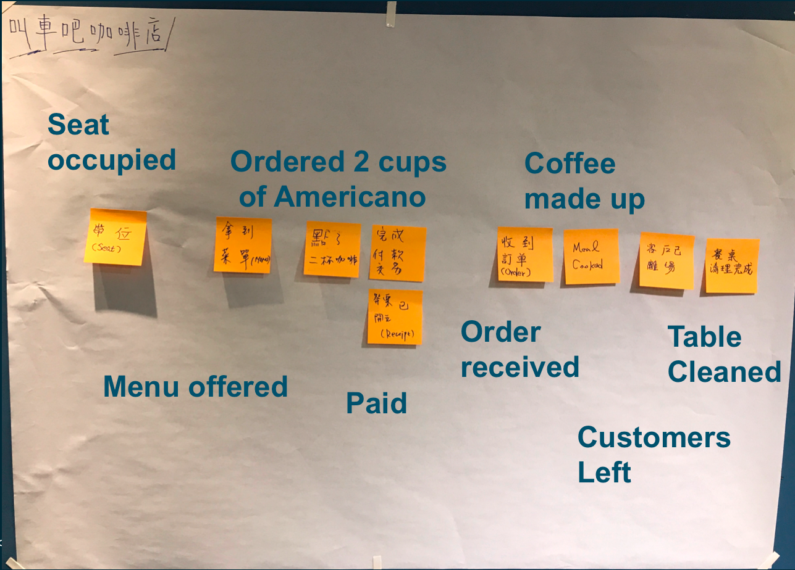
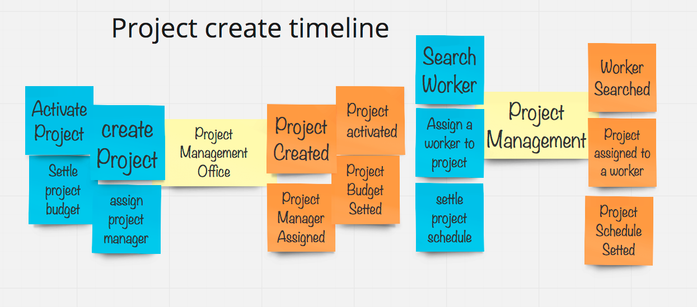
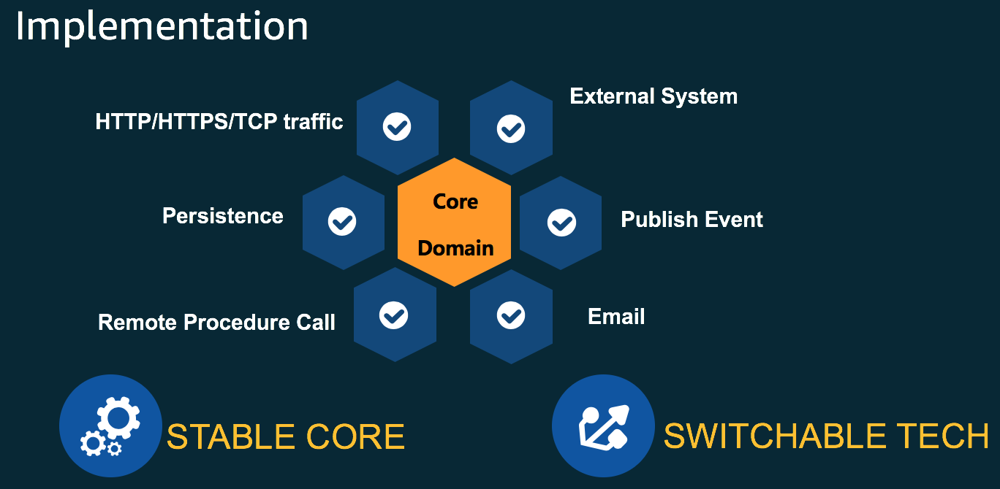
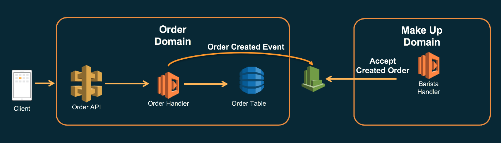

# Implementing DDD on AWS


```bash
picture license free from : Pexels
https://www.pexels.com/photo/background-beverage-breakfast-brown-414645/
```

why you build software ? It's all about solve the business problem. However, there will be a gap from requirements to implementaion, it's a pain point for all stakeholders. As a builder, you may eager to know how to mitigate this gap in a fluent way to deal with it, the Event Storming approach is "The One".

## Why EventStorming


As the Complexity Problem domain growing, it's hard to have a fluent way to help Product Owner and Developer team to collaborate to develop a system which fulfill all of the requirements with correct understanding.

This problem is not a new story, from 2003, Eric Evans has already introduced the "Domain Driven Design" implementing approach to help developers, but it's really hard to implement from the Strategy and Tactic abstraction level.

After several years, Alberto Brandolini introduced the Event Storming approach to go through the DDD concept and make it easy to implement. 

**Event storming is a rapid, lightweight, and underappreciated group modeling technique that is intense, fun, and useful for accelerating development teams**. It's a synthesis of facilitated group learning practices from Gamestorming and the principles of domain-driven design (DDD). The technique isn't limited to software development. Frankly speaking it is recommend to invite all the stakeholders to join the storming workshop, collect each opinions from each viewpoints.

You can apply it to practically any technical or business domain, especially those that are large, complex, or both.

### Event Storming


> Reference from Kenny Bass - https://storage.googleapis.com/xebia-blog/1/2018/10/From-EventStorming-to-CoDDDing-New-frame-3.jpg


Take a look on this diagram, there are a few colorful stickers with different intention:

* **Domain Events** ( Orange sticker ) 
  * **Event**, Stands for the fact happened in specific business context
* **Actions** (Blue sticker)   
  * **Command**, It is a request or intention, raised by a role or time or external system
* **Information** ( Green sticker)  
  * **View Model**, it's a supporting information to help role to make a decision to raise a command
* **Consistent Business Rules** ( Yellow sticker) 
  * **Aggregate**
    * Has the responsibility to accept or fulfill the intention of command
    * Represent a specific business capability to support command
    * Shouldn't naming it with role concept, or you will get only the "actor" in the whole business.
    * Should be in small scope
    * Protects business invariants
    * Exposes by ID
    * And communicated by eventual consistency
* **Eventual Consistent Business rules** (Lilac sticker)
  * Policy
    * It's all about rules, sometimes the rules comes from external regulation restriction, or maybe account login success/fail process logic.
    * example : when login attemptation fail times up to 3, then lock this account

### The benefits from Event Storming

When you want to divide a monolithic system into microservices, or you want to build up a new system from scratch, the most pain point is there is no idea to clarify the system boundary. Even though you interview with domain experts, and get a whole bunch of requirement documents, it still not easy to start the design. Maybe you are familiar with the classic modeling methodologies such as :

> UP/RUP, OOAD, RAD, Use Case Modeling, ICONIX Processing ...etc

No matter any one of these methodologies, all deeply depends on experts skill, but if you apply Event Storming workshop, you could leverage team's collaboration to acquire requirements with key events. However, these events are most concerned business value by stakeholders. With different color, pin, and diagrams to group the actions, events, and the aggregate context. Naturally forms up the domain boundary.

## Ramp up

If you are new to Event Storming, don't know how to start the domain event exploring journey, recommend to think about a timeline: 

> how many immutable fact events occurred, from you wake up at this morning, until now you read this post.



Anyone of you could easily to figure out a couple of stickers there to present what you did in the morning. All of the **past-tense** wording is explaining what happened, immutable fact, and meaningful for your **"working day morning"**.

**[Challenge for you]** Imagine a specific scenario, it's time to attend a meeting but you are probably be late to join, can you pick the most essential stickers to complete the journey on timeline?

> The most key events you picked up, that's the critical path to "Attend meeting". On the other hand, if there is a product under developing, and the Product Owner opens whole bunch of wish list there, what approach will you take to survive under the pressure? 

**The most valuable approach is to leverage "User story mapping" and "Impact mapping". Pick up the most essential ones to developer as first sprint, then continously exploring the story and refine it.**

## Coffee shop business scenario

In order to have a simple scenario to walk through Event Storming workshop, there is a well-known casual scenario - **Drink a cup of coffee in coffee shop.**

> The following images are provided by pixabay with free license.


~ **It's a sunny warm afternoon, you are looking for a coffee shop to have a teatime and think about how to design a new service to fulfill marketing event requirement. Finally, at the corner of street, you found it and would like to make a phone call to colleague come to you.**


~ **You walk in the coffee shop, oncoming scene is the cute menu on the wall. There are multiple choice of drinks to have. Counter kindly remind you could have a seat with great view, and food runner will serve later.**


~ **The seats near by window are mostly occupied, you look for a table with 4 seats which make you comfortable and relax, you ordered 2 cup of Americano for here.**


~ **In house Barista received the coffee order which you ordered from counter(staff), brew up beans and make up coffee.**


~ **Food runner delivered the coffee and receipts.**


~ **after a half of hour, your colleague come to here, you guys start to discusss how to design the new service.**


~ **Enjoyed the teatime, and get a few bright idea from the brainstorming discussion, you leave there, and the Server cleaned the table for next customer(s).**

That's the scenario for the teatime, let's crunch the truth which happened in the story.

## Value proposition

> This is the new material of this workshop, to be updated incrementally. Focus on Impact mapping to facilitate discussion. (2019-06-28 added)


The coffee shop offer drinks and service for passengers, however all of these valuable offering cost a lot of investments. If you operate this coffee shop, how can you reach the goal —> **"Make this coffee shop long live, and offer greate customer experience".**


## Modeling and Development

### Key Business events in the coffeeshop

### Tips

When you are trying to capture events in business scenario, never to talk about technology with other stakeholders, **do respect domain experts, using ubiquitous language to have a clear understanding during communication.**

- Don't tell technology during the business events discovering process
- Don't sell technology concepts
- Aim for core value
- Figure out trigger and result



**All of the immutable events occured:**

* Menu offered
* Seat occupied
* Ordered 2 cup of Americano
* Paid
* Order receieved
* Coffee made (up)
* Customers left
* Table cleaned

> You can always arrange these events in a timeline, sequectially occurred. 

### Roles, Commands and Events mapping

As you explored these immutable events, it's time to think about **"Who make it happened ? "**,  and **What support/offer the capability to serve it, a.k.a  made these events happened? **


In this coffee-shop scenario, we could easily find out several actors(roles) : 

* Client
* Server
* Counter
* Barista

**Let's co-orchestrate it up ! **


A (role) man/women/service raised a command, the command presented the intention, wish to have somebody( ? ) to fulfill the command, serve the command.

The (?), which is the key element to serve request, and process it in internal, once the process finished, the 

**"Command has been processed"**, we use an Event to present the result.

Sometimes, the central element ( named with ? ) could serve the command itself, need to communicate with other business capability provider, then we can publish the event(s) to do next step.

From technical viewpoint, we can adopt pub-sub mechanism to deal with this scenario.

### Most valuable or risky events

When doing the events exploring journey, there will be whole bunch of stickers pasted on the wall, it is impossible to figure out **Role send Command —> Aggregate accept or reject command —> command processed (Event produced)** for all of these stickers.

Let's take an most cost-effective way to do this, take most valuable one or most risky one to go through the exploring. sometimes you can find out more scenario at the meanwhile, and extend the story to enrich the domain knowledge.

### Re-think solutions to serve risky events


Imagine that what if any failure happened will suffer the business in the coffee shop scenario?

* What if the customers ordered coffee without note table number?  
* What if the counter or barista make up coffee which is not ordered? 

No matter which failure or mistakes happened there, the customer experience will be impacted. So we can re-think about these issues to find out further actions to prevent or solve these issues. 

Although this step is not the essential one, but it could help you to **handle business scenario which you were not familiar with before.**

### Aggregate(Blackbox) without a name

Until now, you may realized that the central element ( named with ?) provides business capability, and owns the responsibility to accept or reject commands from client. Yes, it is the **"Aggregate"**.

But at the early stage, encourage team members to focus on gathering events and commands, try to think about the co-relationshop between these events. If those events are relevant to a specific noun, concept, or a role even an organization, just try to pinned them on a yellow sticker and leave the name empty at the moment, maybe just mark it as a **question mark**. Try to defer naming until team has fully knowledge of the domain.

### Aggregate Naming

> Another example for IT guy outsourcing, project management




Once you have the more **question marked yellow stickers**, and feel comfortable to name it, the best time to name it should be event storming exlporing process finished, then naming it with concrete and meaningful  name.

What is the naming convention of Aggregate? There are some examples: 

* By Nouns
* By Gerunds ( V - ing)

No matter which type you favored, remember to present the **"ability"** of the aggregate, that means traverse each command the aggregate is received, and make sure each event occurred in reasonable.

### Bounded Context forming up

With more and more Aggregates being captured, you may found that several aggregates are cohesive, others are not. There is a simple pattern to help you form up the boundary to have a clear bounded context.

- Command A  is fired and it causes Event A 
- Event A  effects View A
- View A is also needed while doing a condition that uses Command B  
- Command A and Command B  might be good to be in one module together.

**Circle these cohesive aggregates together, the boundary is naturally established.**


While you figure out several bounded contexts, there are some co-relationships between each other, some bounded context play the upstream role, some of these play the downstream role. From **Eric Evans'** perspective, there are 9 types of corelationships.


> Context Maps could reflect the collaborative or even organizational teams relationships between different Bounded Contexts in your systems.


It worth to do a "Bounded Context Mapping", chance to know what's the dependencies, what's the impact scope while upstreaming API(contract) changed, and how to prevent the suffer while the changes happend.

> Regarding Bounded Context mapping, recommend to have a quick guide to this document.

[Bounded Context Mapping - by Domain Driven Design Taiwan Community - Eason Kuo](https://www.slideshare.net/YiChengKuo1/implementing-domaindriven-design-study-group-chapter-3-context-maps)


## Development

Now, you have the whole story, bounded context and **just-enough** aggregates, commands, and events. It's time to develop domain model to proof crunched model is correct or not.

> Design & Develop model iteratively and incrementally is recommended, never to run this workshop in a waterfall style, that's spent lots of time but encounter uncontrollable surprise at last-minute.

### Specification by Example

```
Feature: Order Americano in seat

  Scenario: Drink Americano here
    Given the price of a cup of Americano is 80
    When I order 2 cups of Americano
    And decided to have it Here
    And the order is established
    Then the total price should be 160
    And the coffee temperature should be 70 degree c


#    Examples:
#      | coffee    | quantity | price | HereToGo |
#      | Americano | 2        | 80    | true     |

```

Want to have concrete requirements scenario? **The only way is to talk about an example.**

A living doucment help team to collaborate in the same understanding by example.

Try to read the feature and scenario as above, all of the stakeholders could read and understand it, there is no technical term explained there, which is a good way to talk with stakeholder.

Team should co-work on these documents, once the examples confirmed, developers could leverage it to generate a unit test code skeleton, and implement it accordingly.


### TDD within Unit Test environment

In this workshop, cucumber-java is in used to run the example.

```
package solid.humank.cucumberjunit;


import cucumber.api.CucumberOptions;

import cucumber.api.junit.Cucumber;
import org.junit.runner.RunWith;

@RunWith(Cucumber.class)
@CucumberOptions(
        features = "src/test/resources/features",
        glue = "solid.humank.steps"
)
public class RunCucumberTest {
}

```


### Generate unit test code skeleton


By running the cucumber-java steps, Java compiler complained that there are no implementation methods regarding **Feature: Order_Americao**. 

```


You can implement missing steps with the snippets below:

@Given("^the price of a cup of Americano is (\\d+)$")
public void the_price_of_a_cup_of_Americano_is(int arg1) throws Throwable {
    // Write code here that turns the phrase above into concrete actions
    throw new PendingException();
}

@When("^I order (\\d+) cups of Americano$")
public void i_order_cups_of_Americano(int arg1) throws Throwable {
    // Write code here that turns the phrase above into concrete actions
    throw new PendingException();
}

@When("^decided to have it Here$")
public void decided_to_have_it_Here() throws Throwable {
    // Write code here that turns the phrase above into concrete actions
    throw new PendingException();
}

@When("^the order is established$")
public void the_order_is_established() throws Throwable {
    // Write code here that turns the phrase above into concrete actions
    throw new PendingException();
}

@Then("^the total price should be (\\d+)$")
public void the_total_price_should_be(int arg1) throws Throwable {
    // Write code here that turns the phrase above into concrete actions
    throw new PendingException();
}

@Then("^the coffee temperatuere should be (\\d+) degree c$")
public void the_coffee_temperatuere_should_be_degree_c(int arg1) throws Throwable {
    // Write code here that turns the phrase above into concrete actions
    throw new PendingException();
}


Process finished with exit code 0

```

### Implement Domain Model from code Skeleton

It's a TDD style approach, way to fulfill Feature: Order_Americano steps.

```
package solid.humank.steps;

import com.amazonaws.services.cloudwatchevents.AmazonCloudWatchEvents;
import com.amazonaws.services.cloudwatchevents.AmazonCloudWatchEventsClientBuilder;
import com.amazonaws.services.dynamodbv2.AmazonDynamoDB;
import com.amazonaws.services.dynamodbv2.AmazonDynamoDBClientBuilder;
import com.amazonaws.services.dynamodbv2.document.DynamoDB;
import cucumber.api.java.en.Given;
import cucumber.api.java.en.Then;
import cucumber.api.java.en.When;
import solid.humank.domains.Order;

import static org.junit.Assert.assertEquals;

public class OrderAmericanoTest {

    int priceOfAmericano;
    int orderCups;
    boolean isHere;
    int totalPrice;

    Order order;
    String orderString;

    final AmazonCloudWatchEvents cwe =
            AmazonCloudWatchEventsClientBuilder.defaultClient();

    final AmazonDynamoDB client = AmazonDynamoDBClientBuilder.defaultClient();
    final DynamoDB ddb = new DynamoDB(client);

    @Given("^the price of a cup of Americano is (\\d+)$")
    public void the_price_of_a_cup_of_Americano_is(int price) throws Throwable {

        priceOfAmericano = price;
    }

    @When("^I order (\\d+) cups of Americano$")
    public void i_order_cups_of_Americano(int cups) throws Throwable {
        orderCups = cups;
    }

    @When("^decided to have it Here$")
    public void decided_to_have_it_Here() throws Throwable {
        isHere = true;
    }

    @When("^the order is established$")
    public void the_order_is_established() throws Throwable {

        order = new Order("2c",true,"Americano",2,80);
        orderString = order.establish(cwe,ddb);

    }

    @Then("^the total price should be (\\d+)$")
    public void the_total_price_should_be(int sum) throws Throwable {
        assertEquals(sum,order.payAmount());
    }

    @Then("^the coffee temperatuere should be (\\d+) degree c$")
    public void the_coffee_temperatuere_should_be_degree_c(int degree) throws Throwable {
        assertEquals(degree, order.getDrinktemperature());
    }

}

```


## Running on AWS

> This workshop explained  is running on AWS. By using Lambda and cloudwatch event to present how can we keep model classes at the core, and leverage the outside adapter to interact with other domain

## Design each Microservices in Port-adapter concept



> The famous Port-Adapter pattern is the best suite for developing microservices. Focus on core domain problem, and switch any infrastructure or communication tools as you need.


> For this workshop demo, design a order domain object, and leverage AWS services to do persistent, http request accept and handler, and event propagation.

## Using Lambda function as the entry point

You can easily export a lambda function to accept the incomg command, and do some stuff.

## Using CloudWatch Event as the integration Event

If cross boundary event did occured in current domain, never call other domain service directly, just publish a cross-domain-event. On AWS, the most appropriate one is using CloudWatch Event, it's a near-real-time event, high performance and scalable.

## Using DynamoDB as the Write Model/ Read Model persistent Repository

Once capture Model with Domain Experts, you can design Write Model first, and create Query usage Read Model.

## Launch this workshop in Serverless Architecture



This workshop example explained a Coffee shop use case, go through a customer order coffee and barista accept the order then make coffee.

### Prerequisite

1. [Create a Lambda function Execution Role](https://docs.aws.amazon.com/lambda/latest/dg/intro-permission-model.html#lambda-intro-execution-role)
2. [Enable Amazon CloudWatch Logs for API Gateway](https://aws.amazon.com/premiumsupport/knowledge-center/api-gateway-cloudwatch-logs/)
3. [Install AWS CLI](https://aws.amazon.com/cli/)
4. [Install SAM CLI](https://github.com/awslabs/aws-sam-cli)
5. Get used to do Unit Test - mvn test
6. Prepare Java/Maven env by IDE or commandline
7. [Configuring the AWS CLI](https://docs.aws.amazon.com/cli/latest/userguide/cli-chap-getting-started.html)

### Deployment instructions

#### 01 - Define CloudWatchEvent for the Order-created Event

[Define CloudWatch Event for Coffee Order Created Event](/documents/01-define-cloudwatchevent/README.MD)

#### 02 - Deploy Order Domain lambda function with proxy integration on API Gateway

[Deploy Order Domain](/documents/02-deploy-order-domain/README.MD)

#### 03 - Deploy MakeUp Domain lambda function with proxy integration on API Gateway

[Deploy MakeUp Domain](/documents/03-deploy-makeup-domain/README.MD)

#### 04 - Experience and Test the Demo

[Experience Coffee order demo](/documents/04-experience/README.MD)


## Further Information

- Vernon, Vaughn. “Ch. 7, Event Storming.” Domain-Driven Design Distilled, Addison-Wesley, 2016. - https://www.amazon.com/Domain-Driven-Design-Distilled-Vaughn-Vernon/dp/0134434420
- Brandolini, Alberto. Introducing EventStorming. Leanpub, to be released, eventstorming.com/ - https://leanpub.com/introducing_eventstorming
- Brandolini, Alberto. “Ziobrando’s Lair.” Introducing Event Storming, Nov. 2013, ziobrando.blogspot.de/2013/11/introducing-event-storming.html.
- Brandolini, Alberto. Event Storming Recipes. SlideShare, 21 June 2014, de.slideshare.net/ziobrando/event-storming-recipes.
- Rayner, Paul. Event Storming. SlideShare, 26 May 2017, [www.slideshare.net/AgileDenver/event-storming-76390807](http://www.slideshare.net/AgileDenver/event-storming-76390807).
- Brandolini, Alberto. Model Storming. SlideShare, 19 Sept. 2013, [www.slideshare.net/ziobrando/model-storming](http://www.slideshare.net/ziobrando/model-storming).
- Brandolini, Alberto. 50.000 Orange Stickies Later, 7 November 2018, https://www.youtube.com/watch?v=NGXl1D-KwRI
- Business Rules, https://medium.com/plexiti/business-rules-367e430ee168
- How to use Example Mapping & Event Storming, https://hiptest.com/blog/bdd/how-to-use-example-mapping-event-storming/
- What is the Aggregate, https://twitter.com/mathiasverraes/status/1141242508892155904?s=20
- How to monitor Domain Events for Product management, https://xebia.com/blog/eventstorming-and-how-to-monitor-domain-events-for-product-management/


## Special Thanks For

**Jenson Lee** , plays the role as coffee shop owner

**Eason Kuo**, Core team member from Domain Driven Design Taiwan Community

**Arthur Chang** , collaborate design & run the workshop, Co-founder from Domain Driven Design Taiwan Community

**Kenny Baas-Schwegler** , discuss the aggregate definition and ES workshop running experience sharing

## TODO

- Split theis workshop into 3 module - Strategy Design, Tactical Design, Deployment on AWS
- Using AWS SDK for Java v2 to have better performance
- Try to use Dagger2 as the DI framework to have better cold start time
