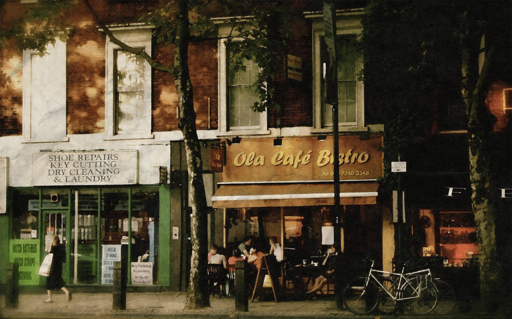
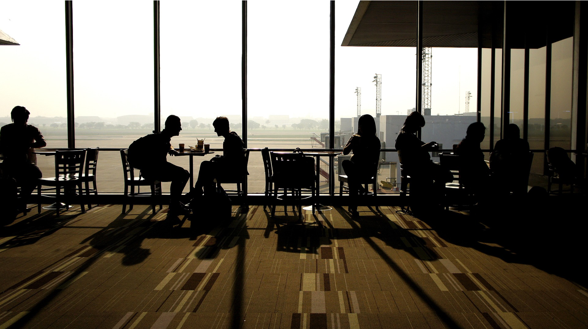
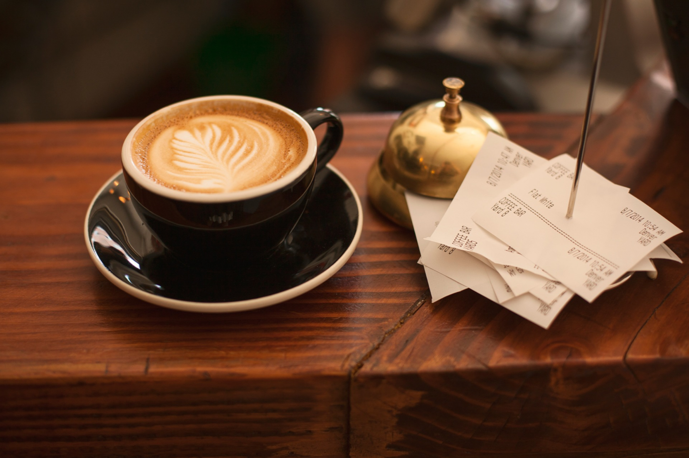
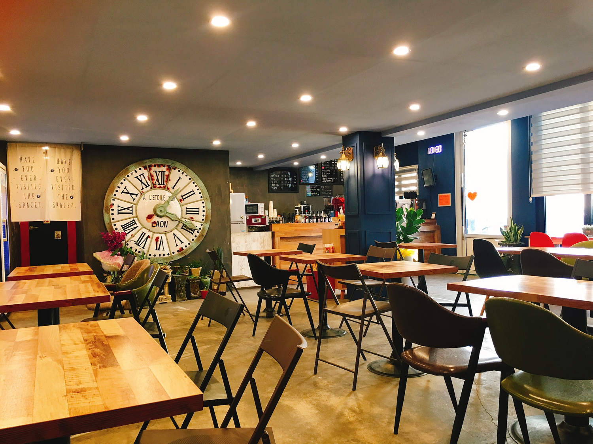

_[< back to 01 Hands-on Events Exploring](../01-hands-on-events-exploring/README.md)_

# Cafe business scenario

Let's dive deeper into how Event Storming works using a simple scenario to walk through the process - **Getting a cup of coffee in a cafe.**

*The following images are provided by pixabay with free license.*

*It's a sunny, warm afternoon. You are looking for a nice cafe for a cup of coffee and to think about how to come up with a proposal for a new marketing event.*

*At the corner of a street, you found a rustic looking cafe. You made a phone call to get a colleague to meet you there as well.*

*You walked into the cafe and was immediately greeted by the huge, enchanting menu on the wall. There is a wide variety of beverage to choose from. The counter staff welcomed you and you placed an order for two Americano. He asks you to have a seat and the coffee will served to you in a few moment.*

*The seats near the windows are mostly occupied. You looked for a table with 4 seats as they look more comfortable,*

*The Barista received the coffee order which you ordered from the counter staff. He brewed the beans, prepared the milk and made the coffee.*

*A waiter delivered the coffee to you with a smile.*

*About half an hour later, your colleague arrived and began the discussion on the marketing proposal.*

*You had a great discussion and left with several new ideas. The cafe waiter cleaned the table in preparation for the next customer.*

That's the scenario for the teatime, let's crunch the truth which happened in the story in the next section.

[Next: 03 Roles, Commands and Events Mapping >](../03-roles-commands-events-mapping/README.md)
