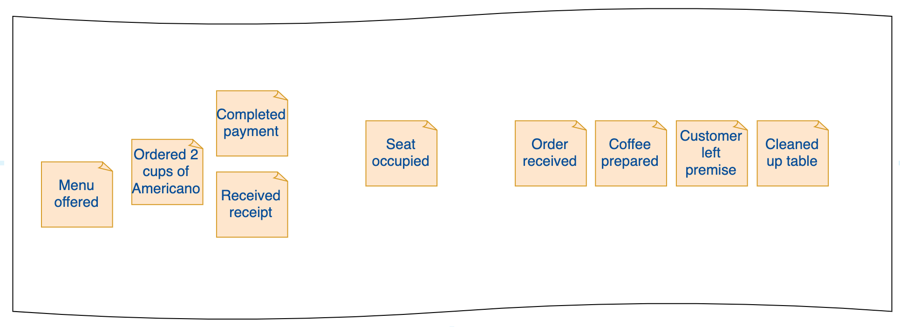
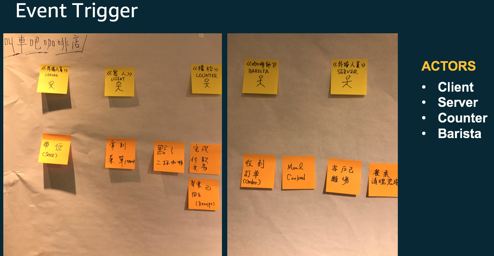
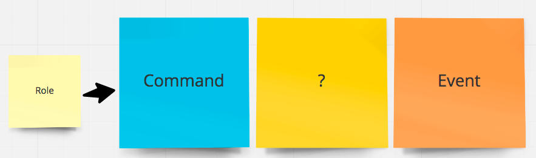
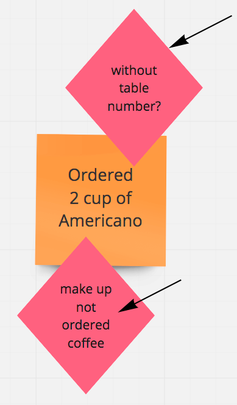
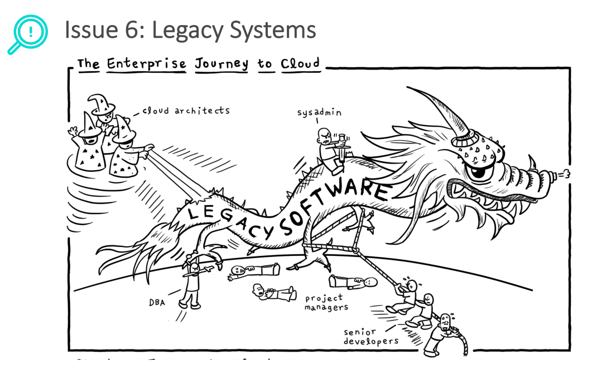

_[< back to 02 Coffee Shop Scenario](../02-coffee-shop-scenario/README.md)_

## Modeling and Development

### Key Business events in the coffeeshop

#### :bulb: Tips:

When capturing Events in business scenarios, be aware that domain experts may not be technical. Use **ubiquitous language** to communicate.
- Events discovering process should not be technical
- Focus on the core business value
- Figure out trigger and result

**An example of the immutable events occurred:**
* Menu offered
* Ordered 2 cups of Americano
* Completed payment
* Received receipt
* Seat occupied
* Order received
* Coffee prepared
* Customer left premise
* Cleaned up table

You can always arrange these events sequentially in the timeline where it occurred.

### Roles, Commands and Events mapping

As you explored these immutable events, it's time to think about **"Who make it happened ? "**,  and **What support/offer the capability to serve it, a.k.a  made these events happened? **

In this coffee-shop scenario, we could easily find out several actors(roles) :

* Client
* Server
* Counter
* Barista

**Let's co-orchestrate it up ! **

A (role) man/women/service raised a command, the command presented the intention, wish to have somebody( ? ) to fulfill the command, serve the command.

The (?), which is the key element to serve request, and process it in internal, once the process finished, the

**"Command has been processed"**, we use an Event to present the result.

Sometimes, the central element ( named with ? ) could serve the command itself, need to communicate with other business capability provider, then we can publish the event(s) to do next step.

From technical viewpoint, we can adopt pub-sub mechanism to deal with this scenario.

### Most valuable or risky events

When doing the events exploring journey, there will be whole bunch of stickers pasted on the wall, it is impossible to figure out **Role send Command —> Aggregate accept or reject command —> command processed (Event produced)** for all of these stickers.

Let's take an most cost-effective way to do this, take most valuable one or most risky one to go through the exploring. sometimes you can find out more scenario at the meanwhile, and extend the story to enrich the domain knowledge.

### Re-think solutions to serve risky events

Imagine that what if any failure happened will suffer the business in the coffee shop scenario?

* What if the customers ordered coffee without note table number?  
* What if the counter or barista make up coffee which is not ordered?

No matter which failure or mistakes happened there, the customer experience will be impacted. So we can re-think about these issues to find out further actions to prevent or solve these issues.

Although this step is not the essential one, but it could help you to **handle business scenario which you were not familiar with before.**

### Aggregate(Blackbox) without a name

Until now, you may realized that the central element ( named with ?) provides business capability, and owns the responsibility to accept or reject commands from client. Yes, it is the **"Aggregate"**.

But at the early stage, encourage team members to focus on gathering events and commands, try to think about the co-relationshop between these events. If those events are relevant to a specific noun, concept, or a role even an organization, just try to pinned them on a yellow sticker and leave the name empty at the moment, maybe just mark it as a **question mark**. Try to defer naming until team has fully knowledge of the domain.

### Aggregate Naming

> Another example for IT guy outsourcing, project management

Once you have the more **question marked yellow stickers**, and feel comfortable to name it, the best time to name it should be event storming exlporing process finished, then naming it with concrete and meaningful  name.

What is the naming convention of Aggregate? There are some examples:

* By Nouns
* By Gerunds ( V - ing)

No matter which type you favored, remember to present the **"ability"** of the aggregate, that means traverse each command the aggregate is received, and make sure each event occurred in reasonable.

### Bounded Context forming up

With more and more Aggregates being captured, you may found that several aggregates are cohesive, others are not. There is a simple pattern to help you form up the boundary to have a clear bounded context.

- Command A  is fired and it causes Event A
- Event A  effects View A
- View A is also needed while doing a condition that uses Command B  
- Command A and Command B  might be good to be in one module together.

**Circle these cohesive aggregates together, the boundary is naturally established.**

While you figure out several bounded contexts, there are some co-relationships between each other, some bounded context play the upstream role, some of these play the downstream role. From **Eric Evans'** perspective, there are 9 types of corelationships.

> Context Maps could reflect the collaborative or even organizational teams relationships between different Bounded Contexts in your systems.

It worth to do a "Bounded Context Mapping", chance to know what's the dependencies, what's the impact scope while upstreaming API(contract) changed, and how to prevent the suffer while the changes happend.

> Regarding Bounded Context mapping, recommend to have a quick guide to this document.

[Bounded Context Mapping - by Domain Driven Design Taiwan Community - Eason Kuo](https://www.slideshare.net/YiChengKuo1/implementing-domaindriven-design-study-group-chapter-3-context-maps)

[Next: 04 Roles, Commands and Events Mapping >](../04-roles-commands-events-mapping/README.md)
