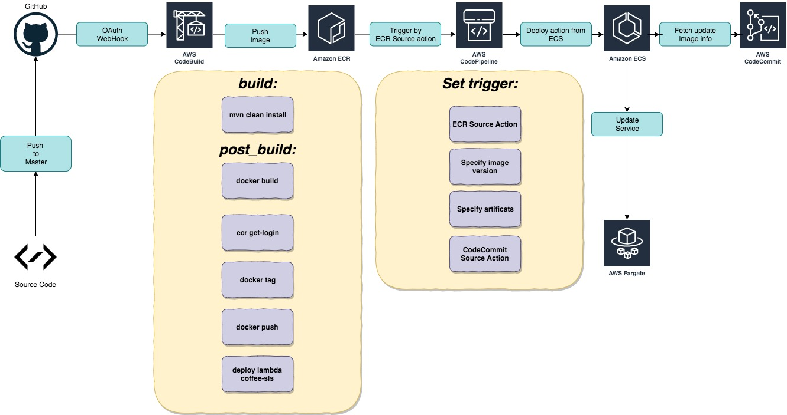
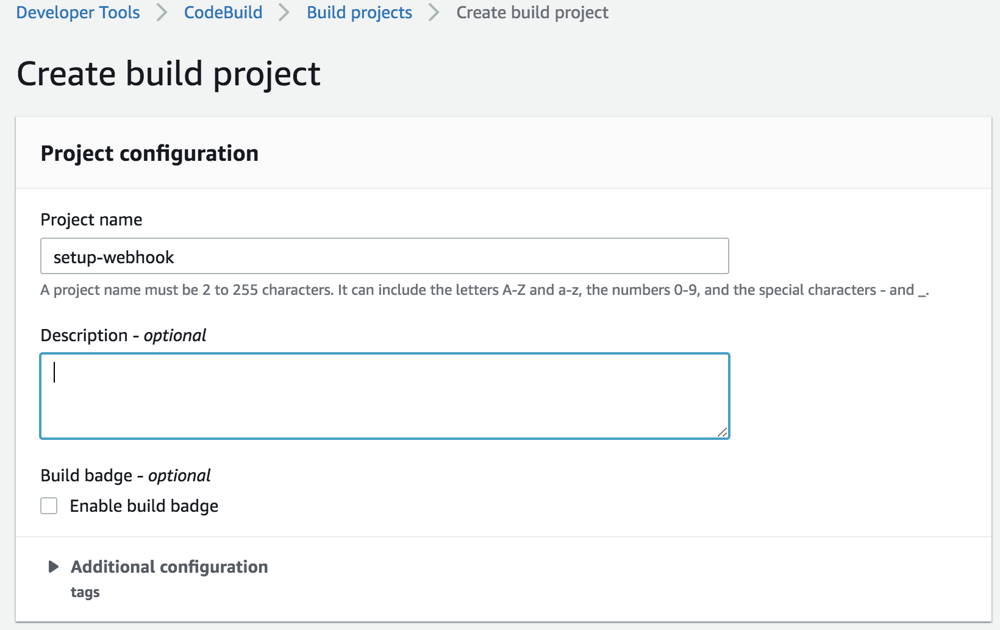
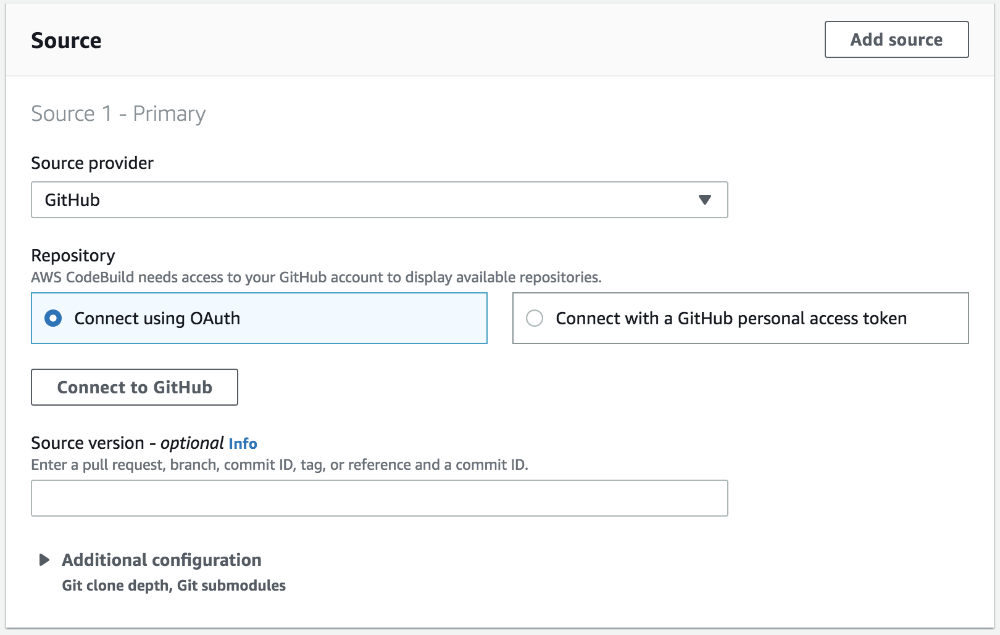
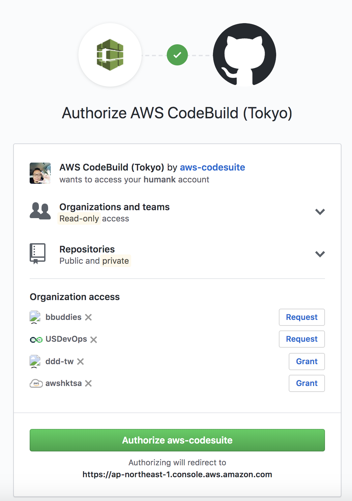
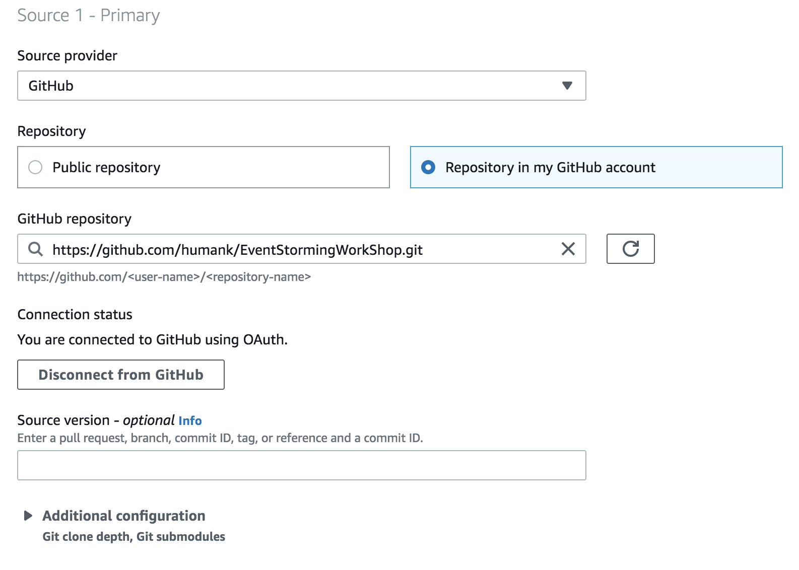
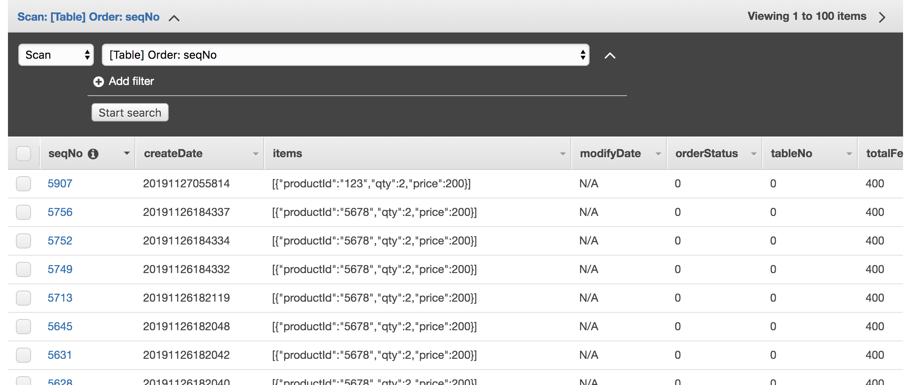

[< back to 04 Modeling and Development >](../04-modeling-and-development/README.md)

# Deploy Coffeeshop application through AWS Code* Suite with AWS CDK

**Kudos for your insist learning from this repository. It's time to deploy the applications to real AWS environment.**




To deploy applications to AWS, you need to have the following essential tools installed:

* [AWS CLI](https://docs.aws.amazon.com/zh_tw/cli/latest/userguide/cli-chap-install.html)
* [AWS CDK](https://docs.aws.amazon.com/cdk/latest/guide/getting_started.html)


## Deploy instruction

### Fork this repo to your own github account

This workshop will leverage Github webhook mechanism to automatically build / deploy application onto aws, so the first step is fork it.

Besides, please also update the repo owner information in theis source code:

**EventStormingWorkShop/deployment/coffeeshop-cdk/lib/coffee-shop-code-pipeline.ts**


>  Replace the owner to your github account.

```typescript
const defaultSource = codebuild.Source.gitHub({
            owner: 'humank',
            repo: 'EventStormingWorkShop',
            webhook: true, // optional, default: true if `webhookFilteres` were provided, false otherwise
            webhookFilters: [
                codebuild.FilterGroup.inEventOf(codebuild.EventAction.PUSH).andBranchIs('master'),
            ], // optional, by default all pushes and Pull Requests will trigger a build
        });
```


-----

### Get Github Webhook integration

Open the AWS Codebuild console, and click the **Create build project**, we will leverage this step to setup webhook, but we don't need to really save this build project, please follow the screenshots.


> Create build project




> Specify source, select github, and then **Click Connect to Github**




> Authorize AWS CodeBuild, click **Authorize aws-codesuite** and confirm **Password**




> Get connected with Github




**Now, your github account is get connected with aws-codesuite, you don't need to save this code project, just cancel it. These steps just for webhook authorization.**

-----

### Deploy infrastructure and Application with Code* family CI/CD pipeline by CDK

**By running this CDK application, You will get a standard VPC with 3 Availablity Zones environment, and one NATGateway serving private subnets.**

**Besides, in order to have an ease of use container orcheration service, an ECS Cluster with Fargate mode is also created.**

### Deploy Application by Code* family

```shell script
cd deployment/coffeeshop-cdk

npm install
npm run build 

cdk synth

cdk bootstrap aws://${your-aws-id}/${your-region-todeploy}

cdk deploy CoffeeShopCodePipeline 
```

**This workshop sample code is developed in Java8 with Quarkus Framework, Libs dependency managed by Maven. By running this CDK CoffeeShopCodePipeline stack, You will have:**

* ECR - Will create a Docker Image repository to serve Orders-Web application.
* CodeCommit Repository - for auto deployment
* CodeBuild - Get Github WebHooked project, build source code, build docker image, Push image to ECR,  deploy **Orders-web** Fargate Service, deploy **coffee-sls Lambda Function**, create **Dynamodb Table -{ Order, Coffee}**, create Event Rule in default **Amazon EventBridge** ..etc.


**Deploy Result**

```shell
Outputs:
CoffeeShopCodePipeline.CodeBuildProjectName = CodeBuildProject
CoffeeShopCodePipeline.AlbSvcServiceURL46A1D997 = http://Coffe-AlbSv-5MLHALGIGWUB-82783022.us-west-2.elb.amazonaws.com
CoffeeShopCodePipeline.AlbSvcLoadBalancerDNS20AA0F0B = Coffe-AlbSv-5MLHALGIGWUB-82783022.us-west-2.elb.amazonaws.com
CoffeeShopCodePipeline.Hint =
Create a "imagedefinitions.json" file and git add/push into CodeCommit repository "EventStormingWorkshop" with the following value:

[
  {
    "name": "defaultContainer",
    "imageUri": "123456789012.dkr.ecr.us-west-2.amazonaws.com/solid-humank-coffeeshop/orders-web:latest"
  }
]

CoffeeShopCodePipeline.Bucket = coffeeshop-nypea
CoffeeShopCodePipeline.CodeCommitRepoName = EventStormingWorkshop
CoffeeShopCodePipeline.ServiceURL = http://Coffe-AlbSv-5MLHALGIGWUB-82783022.us-west-2.elb.amazonaws.com
CoffeeShopCodePipeline.StackName = CoffeeShopCodePipeline
CoffeeShopCodePipeline.StackId = arn:aws:cloudformation:us-west-2:584518143473:stack/CoffeeShopCodePipeline/f10c0520-0618-11ea-8122-023709c486f0

Stack ARN:
arn:aws:cloudformation:us-west-2:584518143473:stack/CoffeeShopCodePipeline/f10c0520-0618-11ea-8122-023709c486f0
```

Do remember to create a "imagedefinitions.json" file and git add/push into CodeCommit repository "EventStormingWorkshop" with the following value:

[
  {
    "name": "defaultContainer",
    "imageUri": "your ecr repository arn for this coffeeshop/solid-humank-coffeeshop/orders-web:latest"
  }
]


### Way to Deploy applications 

You could deploy these applications via two approach: 

1. At first time, self manually deploy application in Codebuild service, just to select the codebuild project and click the **start build** button,  then the deployment process will be started.
2. Anytime, if you make any chang on the EventStormingWorkshop repository on github, while you commit and push  to  master branch, then the CodeBuild service will automatically buid it and trigger the codepipeline to deploy all these applications.

### Setup Lambda function trigger with EventBridge

```shell
targetArn=$(aws lambda get-function --function-name coffee-sls-OrderCreatedHandler | jq '.Configuration.FunctionArn')

aws events  put-targets --rule OrderCreatedRule --targets "Id"="OrderCreated","Arn"=$targetArn

ruleArn=$(aws events list-rules --name-prefix OrderCreatedRule | jq -r '.Rules[0].Arn')

aws lambda add-permission \
	--function-name coffee-sls-OrderCreatedHandler \
  --action lambda:InvokeFunction \
	--statement-id stat-coffee-sls \
  --principal events.amazonaws.com \
	--source-arn $ruleArn
```

### Run Test

**As all of the setting done, now you could hit the url which you created to make an coffee order:**

The **Orders-web** service endpoint is the Stack output - **CoffeeShopCodePipeline.AlbSvcServiceURLxxxx**

```shell
curl --header "Content-Type: application/json" \                                                                                            
        --request POST \
        --data '{"items":[{"productId":"5678","qty":2,"price":200}]}' \
        http://Coffe-AlbSv-6K6V97WJT6AV-1556524944.us-west-2.elb.amazonaws.com/order

Result : 
{"items":[{"productId":"5678","qty":2,"price":200,"fee":400}],"status":0,"id":"ord-20191126-5906","createdDate":1574801783.400000000,"modifiedDate":null}
```

**Check the order table in DynamoDB**



**Check the lambda function(Order created event Handler) logs**

Visit Cloudwatch Service web page, search log groups : ***/aws/lambda/coffee-sls-OrderCreatedHandler***

```shell script
START RequestId: acfc1cf1-ba73-402e-921d-2fa2d95af5dc Version: $LATEST
2019-11-27 05:58:23 [main] INFO  solid.humank.coffeeshop.cofee.sls.orders.OrderCreatedHandler:39 - 0
2019-11-27 05:58:23 [main] INFO  solid.humank.coffeeshop.cofee.sls.orders.OrderCreatedHandler:40 - 7ebdf9f0-888d-540e-038d-bd6e25bea29f
2019-11-27 05:58:23 [main] INFO  solid.humank.coffeeshop.cofee.sls.orders.OrderCreatedHandler:41 - null
2019-11-27 05:58:23 [main] INFO  solid.humank.coffeeshop.cofee.sls.orders.OrderCreatedHandler:42 - solid.humank.coffeeshop.order
2019-11-27 05:58:23 [main] INFO  solid.humank.coffeeshop.cofee.sls.orders.OrderCreatedHandler:43 - 584518143473
2019-11-27 05:58:23 [main] INFO  solid.humank.coffeeshop.cofee.sls.orders.OrderCreatedHandler:44 - 2019-11-27T05:58:18Z
2019-11-27 05:58:23 [main] INFO  solid.humank.coffeeshop.cofee.sls.orders.OrderCreatedHandler:45 - us-west-2
2019-11-27 05:58:23 [main] INFO  solid.humank.coffeeshop.cofee.sls.orders.OrderCreatedHandler:46 - [Ljava.lang.String;@7ca48474
2019-11-27 05:58:23 [main] INFO  solid.humank.coffeeshop.cofee.sls.orders.OrderCreatedHandler:47 - 0
2019-11-27 05:58:23 [main] INFO  solid.humank.coffeeshop.cofee.sls.orders.OrderCreatedHandler:48 - bd56e57b-1575-49b0-b002-a8ef33c926a2
2019-11-27 05:58:23 [main] INFO  solid.humank.coffeeshop.cofee.sls.orders.OrderCreatedHandler:49 - 1
2019-11-27 05:58:23 [main] INFO  solid.humank.coffeeshop.cofee.sls.orders.OrderCreatedHandler:50 - EntityId(abbr=ord, seqNo=5907, occurredDate=2019-11-27T05:58:14.881Z)
2019-11-27 05:58:24 [main] DEBUG software.amazon.awssdk.request:84 - Sending Request: DefaultSdkHttpFullRequest(httpMethod=POST, protocol=https, host=dynamodb.us-west-2.amazonaws.com, encodedPath=/, headers=[amz-sdk-invocation-id, Content-Length, Content-Type, User-Agent, X-Amz-Target], queryParameters=[])
2019-11-27 05:58:27 [main] DEBUG software.amazon.awssdk.request:84 - Received successful response: 200
2019-11-27 05:58:27 [main] DEBUG software.amazon.awssdk.request:84 - Sending Request: DefaultSdkHttpFullRequest(httpMethod=POST, protocol=https, host=dynamodb.us-west-2.amazonaws.com, encodedPath=/, headers=[amz-sdk-invocation-id, Content-Length, Content-Type, User-Agent, X-Amz-Target], queryParameters=[])
2019-11-27 05:58:27 [main] DEBUG software.amazon.awssdk.request:84 - Received successful response: 200
Coffee made...
END RequestId: acfc1cf1-ba73-402e-921d-2fa2d95af5dc
REPORT RequestId: acfc1cf1-ba73-402e-921d-2fa2d95af5dc	Duration: 8150.39 ms	Billed Duration: 8200 ms	Memory Size: 512 MB	Max Memory Used: 156 MB	Init Duration: 887.71 ms
```

**Check the coffee table in DynamoDB**


Now,  you have go through all ofthe whole coffee ordering process journey, in case you would like to hands-on more, just implement more business scenario as you can, and taste all these **Cloud coffeeshop on AWS.**

