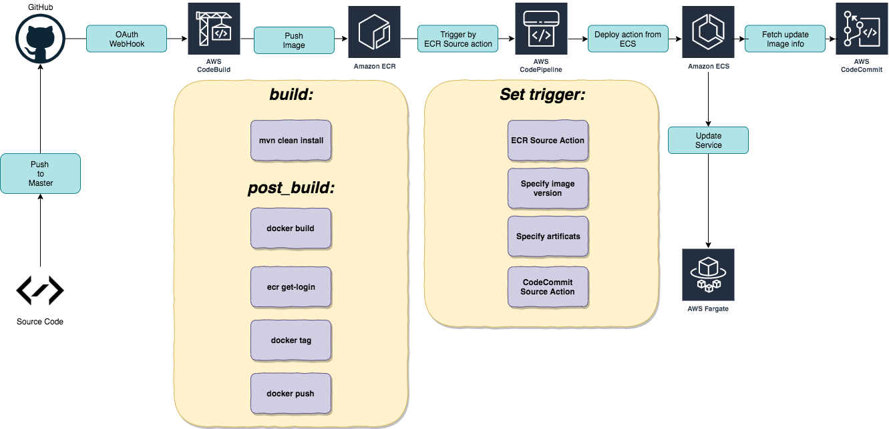

# Deploy Coffeeshop application automatically through AWS Code* family with AWS CDK


**Kudos for your insist learning from this repository. It's time to deploy the applications to real AWS environment.**




To deploy applications to AWS, you need to have the following essential tools installed:

* AWS CLI
* AWS CDK

quick deploy: 

```shell script
cd deployment/coffeeshop-cdk

npm run build 

cdk synth

cdk deploy CoffeeShopCdkStack CoffeeShopCodePipeline 
```